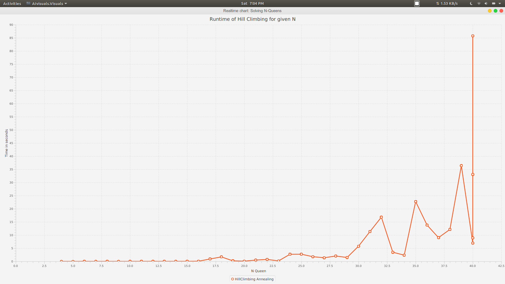
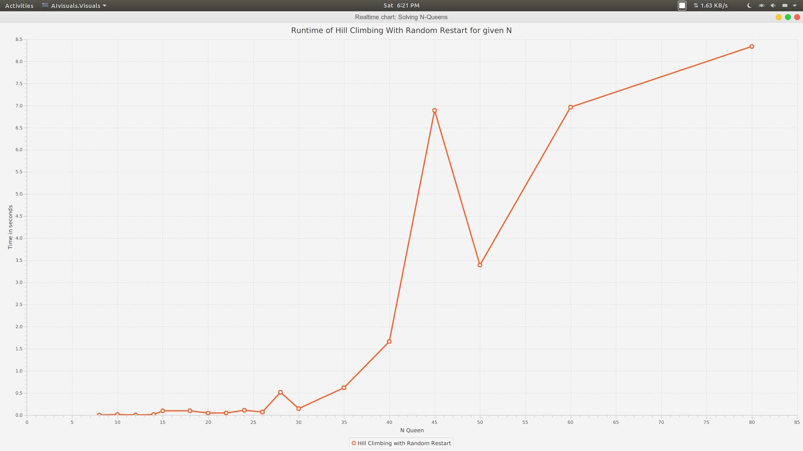

##### N_Queens Solution using Hill Climbing, HillClimbing with Random restart and simulated Annealing created during undergrad course in Artificial Intelligence

Javafx, Cpp, python.

HillClimbing Performance

  
RandomRestart Performance

SimulatedAnnealing Performance

